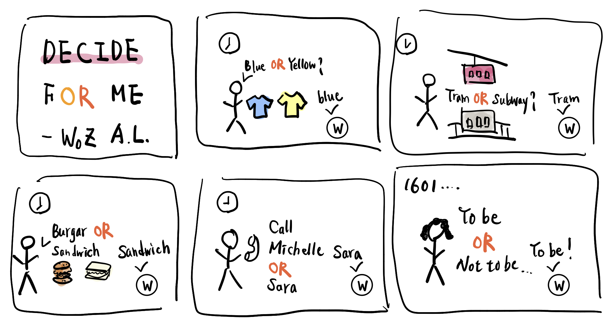

# You're a wizard, A.L.


In this lab, we want you to practice wizarding an interactive device as discussed in class. We will focus on audio as the main modality for interaction but there is no reason these general techniques can't extend to video, haptics or other interactive mechanisms. In fact, you are welcome to add those to your project if they enhance your design.


## Text to Speech and Speech to Text

In the home directory of your Pi there is a folder called `text2speech` containing some shell scripts.

```
pi@ixe00:~/text2speech $ ls
Download        festival_demo.sh  GoogleTTS_demo.sh  pico2text_demo.sh
espeak_demo.sh  flite_demo.sh     lookdave.wav

```

you can run these examples by typing 
`./espeakdeom.sh`. Take some time to look at each script and see how it works. You can see a script by typing `cat filename`

```
pi@ixe00:~/text2speech $ cat festival_demo.sh 
#from: https://elinux.org/RPi_Text_to_Speech_(Speech_Synthesis)#Festival_Text_to_Speech

echo "Just what do you think you're doing, Dave?" | festival --tts

```

You can also play audio files directly with `aplay filename`.

After looking through this folder do the same for the `speech2text` folder. In particular, look at `test_words.py` and make sure you understand how the vocab is defined. Then try `./vosk_demo_mic.sh`

## Serving Pages

In Lab 1 we served a webpage with flask. In this lab you may find it useful to serve a webpage for the controller on a remote device. Here is a simple example of a webserver.

```
pi@ixe00:~/$ python server.py
 * Serving Flask app "server" (lazy loading)
 * Environment: production
   WARNING: This is a development server. Do not use it in a production deployment.
   Use a production WSGI server instead.
 * Debug mode: on
 * Running on http://0.0.0.0:5000/ (Press CTRL+C to quit)
 * Restarting with stat
 * Debugger is active!
 * Debugger PIN: 162-573-883
```
From a remote browser on the same network, check to make sure your webserver is working by going to [http://ixe00.local:5000]()


## Demo

In the [demo directory](./demo), you will find an example wizard of oz project you may use as a template. **You do not have to** feel free to get creative. In that project, you can see how audio and sensor data is streamed from the Pi to a wizard controller that runs in the browser. You can control what system says from the controller as well.

## Optional

There is an included [dspeech](./dspeech) demo that uses [Mozilla DeepSpeech](https://github.com/mozilla/DeepSpeech) for speech to text. If you're interested in trying it out we suggest you create a seperarate virutalenv. 


# Lab 3 Part 2

Create a system that runs on the Raspberry Pi that takes in one or more sensors and requires participants to speak to it. Document how the system works and include videos of both the system and the controller.

## Prep for Part 2

1. Sketch ideas for what you'll work on in lab on Wednesday.



## Share your idea sketches with Zoom Room mates and get feedback

*what was the feedback? Who did it come from?*

> Feedback from Cheng-Wei and Renzhi
>
> They thought it's a very useful idea since all of us facing various decisions in our daily lives. To avoid decision fatigue, Decide For Me could really help people. Even though the selections are made in random, it's still valid because we usually are good with either and just need some nudges.

## Prototype your system

The system should:
* use the Raspberry Pi 
* use one or more sensors
* require participants to speak to it. 

*Document how the system works*

> Recognize the keyword "OR"
>
> Group the words before and after the "OR"
>
> Randomly select one of the two groups

*Include videos or screencaptures of both the system and the controller.*

[Decide for me!](https://www.youtube.com/watch?v=QvLJ8aNZIcQ)

## Test the system
Try to get at least two people to interact with your system. (Ideally, you would inform them that there is a wizard _after_ the interaction, but we recognize that can be hard.)

Answer the following:

### What worked well about the system and what didn't?
> The system recognizes words decently but sometimes still fails.

### What worked well about the controller and what didn't?

> If controller means something like the webpage in the example, I think there is no controller in my setup. In general, the controller is the person talking to the device, and this part works well once participants know the rule and include the keyword "OR" in their questions.

### What lessons can you take away from the WoZ interactions for designing a more autonomous version of the system?

> - Try different models to improve the recognition and also support different languages
>
> - To enhance user's confidence in the decision, maybe this device should remain the same answer for the same decision for a fixed time period 


### How could you use your system to create a dataset of interaction? What other sensing modalities would make sense to capture?

> I expect it would be really interesting to collect a database of the most frequently asked questions in people's lives. Other sensing modalities could include temperature monitoring for both human bodies and weather outside so that the device could suggest a wiser selection regarding clothes or food.

